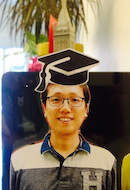

### Jaeduk Han, Ph.D.

* **Email** : jdhan at eecs dot berkeley dot edu
* [**CV**](CV_JDHAN_190731.pdf)
* [**Google Scholar**](https://scholar.google.com/citations?user=l3DrF84AAAAJ&hl=en)
* [**Linkedin**](https://www.linkedin.com/in/jaeduk-han-98b20930)

#### Biography
Jaeduk Han is an Assistant Professor of Electronic Engineering at Hanyang University.
He received the B.S., and M.S. degrees with honors from Seoul National University (SNU)
in 2007 and 2009, respectively, and his Ph.d degree from University of California, 
Berkeley in 2017. From 2009 to 2017, he has held various full-time and internship positions at TLI, 
Altera (now Intel FPGA), Intel, Xilinx, and Apple. 

Dr. Han was a recipient of a KFAS graduate study fellowship in 2009, a KFAS doctoral study 
fellowship in 2012, the SNU EECS best tutor award in 2008, and the UC Berkeley EECS 
outstanding course development and teaching award in 2016.

His research interests include design and automatic generation of high-performance 
integrated circuits, LED lighting systems, silicon photonics, and bio-electronic systems.

[//]: # (<* My research map>)
[//]: # ([alt text]research_map.png)

#### Education
* Ph.D.	University of California, Berkeley, EECS, Berkeley, CA, 2012 – 2017.
* M.S.	Seoul National University, EECS, Seoul, Korea,	2007 – 2009.
* B.S.	Seoul National University, EECS, Seoul, Korea,	2003 – 2007.

#### Academic Experience
* Assistant Professor, Electronic Engineering, Hanyang University, 2019 – present.
* Graduate Student Researcher, UC Berkeley, 2012 – 2017.
* Graduate Student Instructor, [EE16B](http://inst.eecs.berkeley.edu/~ee16b/sp16/), UC Berkeley, Summer 2016.
* Graduate Student Instructor, [EE16A](http://inst.eecs.berkeley.edu/~ee16a/fa15/), UC Berkeley, Fall 2015.
* Research Assistant, Seoul National University, 2007 – 2009.
* Teaching Assistant, Digital Integrated Circuits, Seoul National University, 2018.
* Teaching Assistant, Electronic Circuits II, Seoul National University, 2018.
* Teaching Assistant, Electronic Circuits I, Seoul National University, 2017.

#### Industry Experience
* SERDES Designer, Apple, Aug. 2017 – Jul. 2019.
* SEG Intern, Apple, May. 2016 – Aug. 2016.
* Analog/Mixed Signal Design Intern, Xilinx, May. 2015 – Dec. 2015.
* Graduate Intern Technical, Intel, Jun. 2014 – Sep. 2014.
* Research Intern, Altera (now Intel FPGA), Jun. 2012.
* Engineer, TLI, Mar. 2009 – Mar. 2012.
